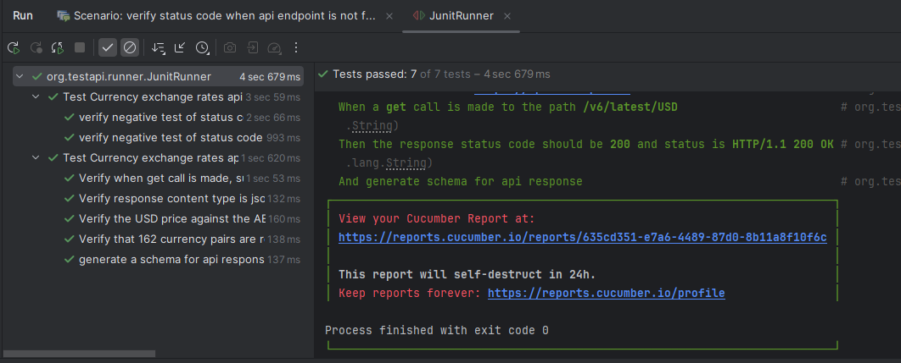

## Automate Currency exchange API

### It is a BDD project, I've implemented it using Cucumber with Rest Assured and have used Maven as build management tool, used cucumber reports for the reporting part

#### The test scripts are placed in src/test/resources/org/testapi/featurefiles and the step definition in src/test/java/org/testapi/stepdefinition
#### To execute cucumber feature files, Runner class named "JunitRunner" is used which is placed in folder path "src/test/java/org/testapi/runner"
#### Reports can be viewed in prettified html format at "target/cucumber-report.html" or can be viewed by hitting "https://reports.cucumber.io/reports/{xyz}"
For the reference I've attached screenshot below

#### I'm reading the hostname and endpoint using properties file

#### Utility class named TestUtils.java is placed inside "src/main/java/org/testapi/utils" package
